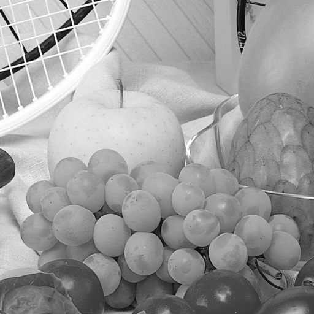
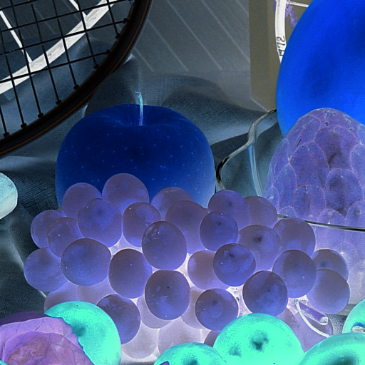
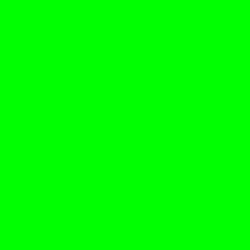
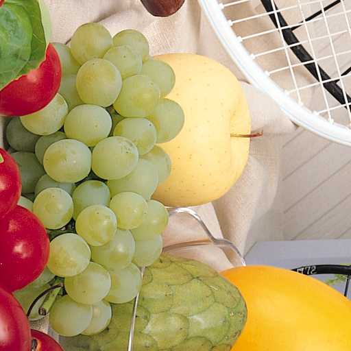
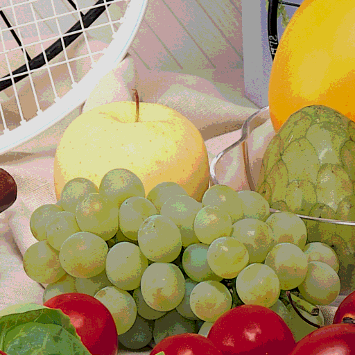
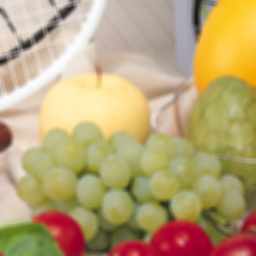
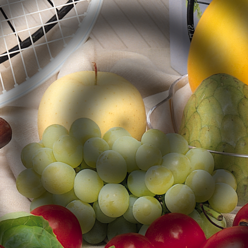
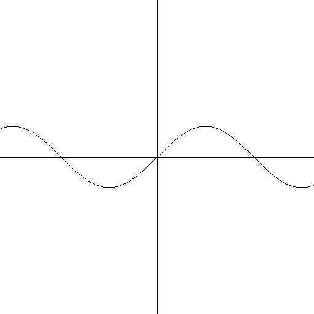
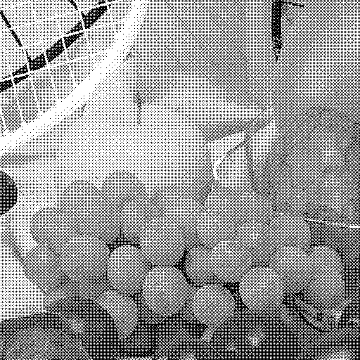

# Imageomatic

#### A C project that implements a set of image filters

To run this project, please run the command `make` in the terminal inside the project directory. Afterwards, run `./Imageomatic`.

Commands:

- `A <filename>` &#8594; Loads the image into register **A**
- `B <filename>` &#8594; Loads the image into register **B**

  

- `+ <filename>` &#8594; Generates a new file with the image that is in register **A**
- `C` &#8594; Copies the image from register **B** to register **A**
- `Q` &#8594; Converts the image in register **A** to grayscale
  
  
  
- `N` &#8594; Converts the image in register **A** to negative
  
  
  
- `H` &#8594; Scales the image in register **A** to half its original size
  
  

- `P <color> <width> <height>` &#8594; Generates a solid color image with the width and height chosen. The color can be in hexadecimal or a name of a color in `cores.txt`. The image is saved in register **A**
  
  

- `R` &#8594; Rotates 90º the image in register **A**
  
  
  
- `O <level>` &#8594; Posterizes the image in register **A**. `level` must be an integer between 0 and 8
  
  
  
- `G <width> <height>` &#8594; Generates an image simulating the waves created by a drop of water. The image is saved in register **A**
  
  
  
- `D <level>` &#8594; Blurs the image in register **A**
  
  
  
- `M` &#8594; Merges the images in register **A** and **B**. The images must have the same size 
  
  
  
- `F <width> <height> <scale>` &#8594; Generates an image with the graph of a function. The image is saved in register **A**
  
  
  
- `T` &#8594; Converts the image in register **A** using a dithering algorithm
  
  
  
- `E <message>` &#8594; Hides a message in the image that is in register **A** (Steganography)
- `Z` &#8594; Ends the program

